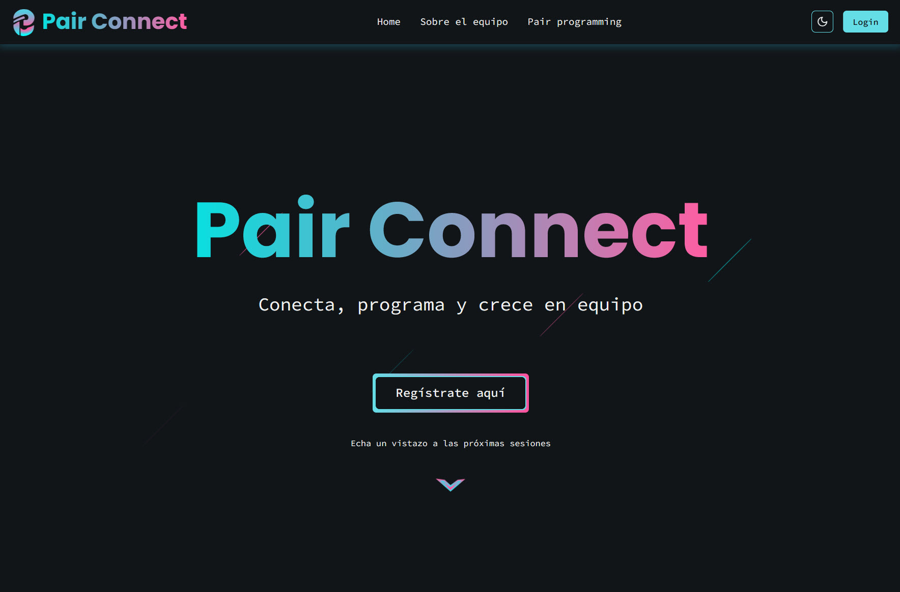
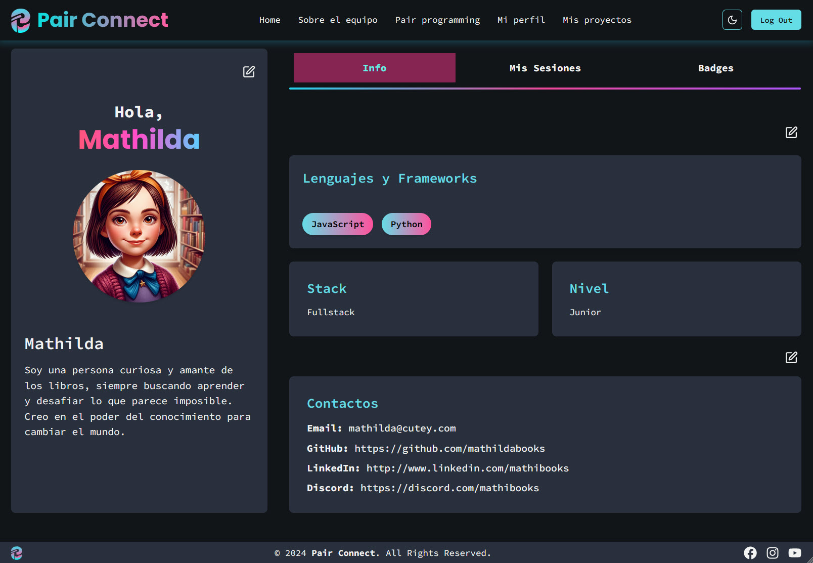
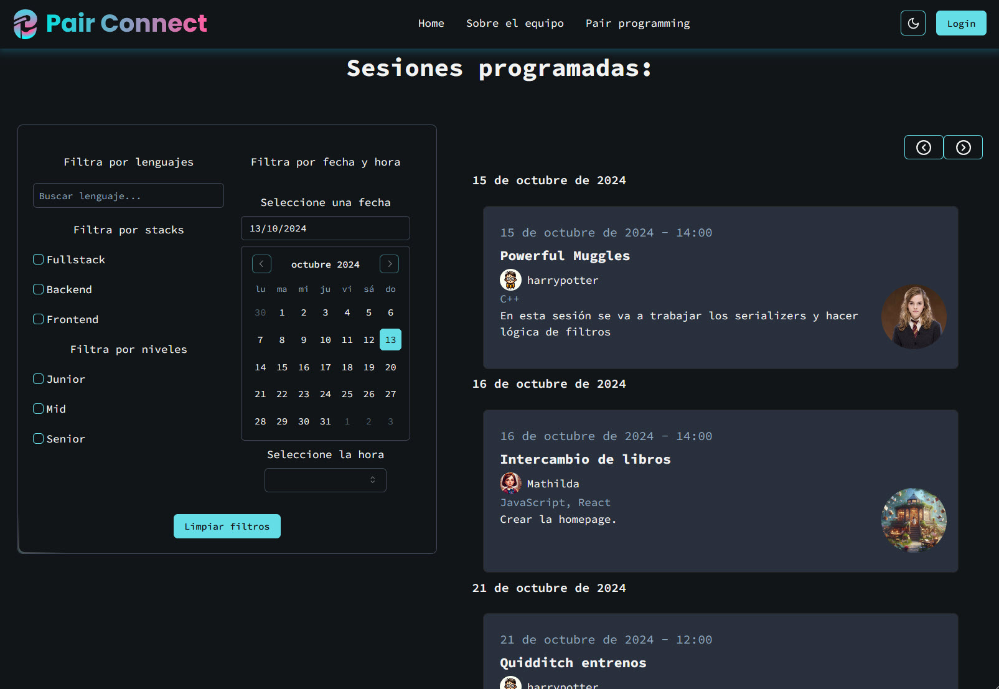
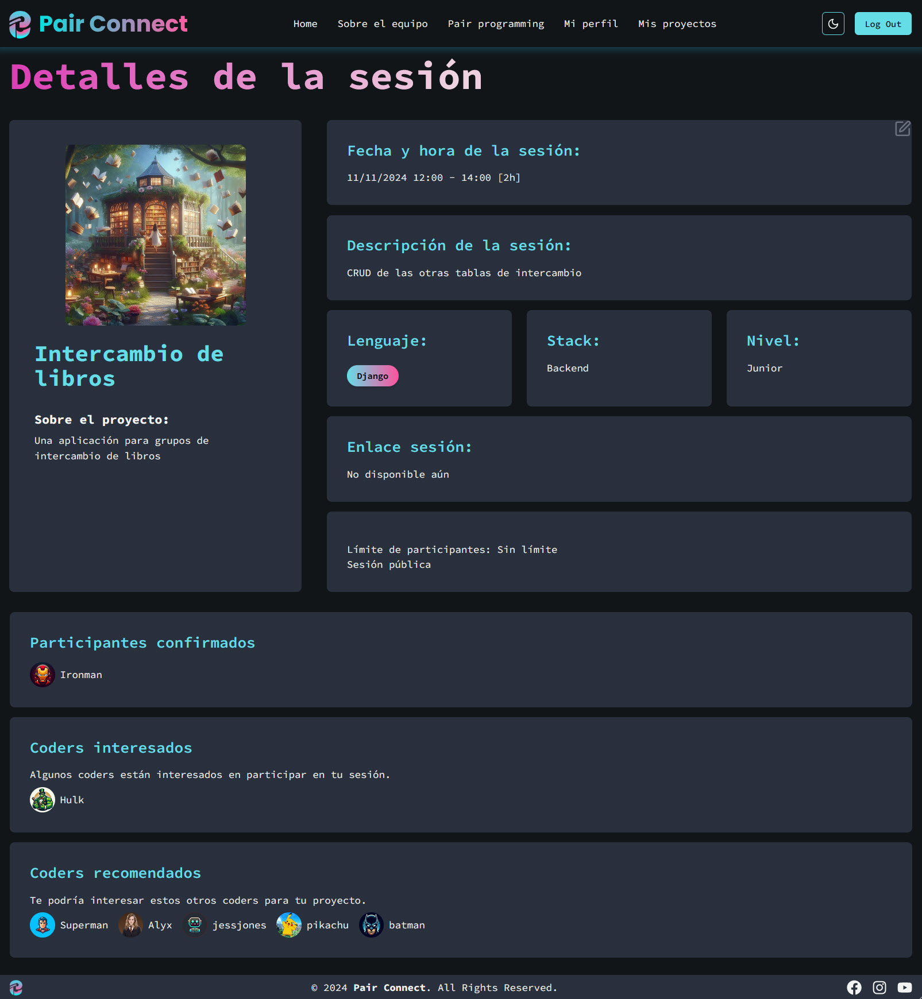

# Pair Connect 💻

## Table of Contents

- [Project Overview ✨](#project-overview-)
- [Installation 🛠️](#installation-)
  - [Requirements](#requirements-)
- [Project Structure 💻](#project-structure-)
- [Technologies 🚀](#technologies-)
- [Usage 🔥](#usage-)
- [Contribution 🤝](#contribution-)
- [Authors 👩‍💻](#authors-)
- [Demo 👓](#demo-)

## Project Overview ✨

**Pair Connect** is a platform where developers can connect for pair programming sessions based on their skills, including stack, experience level, and programming languages, as well as project preferences.

The backend is built with Django and Django REST Framework, while the React-based frontend integrates the API to display session suggestions tailored to the user's skills and preferences.

[Go to backend repository](https://github.com/Fire-Fairy84/pair_connect_back)

### Key Features

- User registration and authentication with **Djoser** and **JWT**.
- Profile management, including skills such as programming languages, stack, and experience level.
- Session recommendations based on the user's profile (stack, level, or programming languages).
- Creation and management of projects and pair programming sessions.
- Integration of **Cloudinary** for profile image storage.
- Email notification system to stay updated on sessions.

## Installation 🛠️

### Requirements

- [Python 3.x](https://www.python.org/downloads/)
- [PostgreSQL](https://www.postgresql.org/download/)
- [Virtualenv](https://virtualenv.pypa.io/en/latest/)
- [Git](https://git-scm.com/)
- [Nodejs](https://nodejs.org/en/download/package-manager)
- [React](https://react.dev/)

### Installation for Backend

1. Clone the backend repository:

   ```bash
   git clone https://github.com/your-username/pair_connect_back
   ```

2. Create and activate a virtual environment:

   ```bash
   cd pair_connect_back
   python -m venv env
   source env/bin/activate  # On Windows use: env\Scripts\activate
   ```

3. Install the dependencies:

   ```bash
   pip install -r requirements.txt
   ```

4. Set up your **PostgreSQL** database and update the credentials in the `settings.py` file.

5. Run the migrations and start the server:

   ```bash
   python manage.py makemigrations
   python manage.py migrate
   python manage.py runserver
   ```

With these steps, the backend will be up and running locally, ready to handle user authentication, session management, and other core functionalities through the API.

### Installation for Frontend

1. Clone the frontend repository:

   ```bash
   git clone https://github.com/your-username/pair_connect_front
   ```

2. Navigate into the project directory:

   ```bash
   cd pair_connect_front
   ```

3. Install the dependencies:

   ```bash
   npm install
   ```

4. Start the development server:

   ```bash
   npm run dev
   ```

5. Open your browser and navigate to the local development server, typically available at:

   ```
   http://localhost:5173
   ```

With these steps, the frontend will be up and running locally, connecting with the backend API for session suggestions and other functionalities.

## Project Structure 💻

### Backend Folder Structure

The project follows a standard structure for Django applications with modular organization to handle user profiles, sessions, and other features.

```plaintext
/
├── pair_connect
│   ├── projects/
│   │   ├── migrations/
│   │   ├── models.py
│   │   ├── serializers.py
│   │   ├── views.py
│   │   └── ...
│   ├── skills/
│   │   ├── migrations/
│   │   ├── models.py
│   │   ├── serializers.py
│   │   ├── views.py
│   │   └── ...
│   ├── users/
│   │   ├── migrations/
│   │   ├── models.py
│   │   ├── serializers.py
│   │   ├── views.py
│   │   └── ...
│   ├── manage.py
│   ├── requirements.txt
│   └── README.md
```

### Frontend Folder Structure

The project follows a standard structure for React applications, with a modular organization to manage components, pages, and core features like session handling and user profiles.

```plaintext
/
├── public/
│   ├── index.html
│   └── ...
├── src/
│   ├── assets/
│   │   └── images/
│   ├── components/
│   │   ├── about/
│   │   │   └── ...
│   │   ├── auth/
│   │   │   └── ...
│   │   ├── icons/
│   │   │   └── ...
│   │   └── .../
│   ├── hooks/
│   │   └── ...
│   ├── pages/
│   │   ├── AboutUsPage.jsx
│   │   ├── ActivationPage.jsx
│   │   ├── ForgotPasswordPage.jsx
│   │   ├── HomePage.jsx
│   │   └── ...
│   ├── services/
│   │   ├── authService.jsx
│   │   ├── sessionService.jsx
│   │   └── ...
│   ├── styles/
│   │   ├── cosmic-background.css
│   │   ├── navbar-profile.css
│   │   └── ...
│   ├── utils/
│   │   ├── findMatchedValues.jsx
│   │   ├── sessionPagination.jsx
│   │   └── ...
│   ├── wrappers/
│   │   └── HomePageWrapper.jsx
│   ├── App.jsx
│   ├── index.css
│   ├── main.jsx
│   └── tests
│       └── ...
│   └── tailwind.config.js

```

## Technologies 🚀

### Backend Technologies

The backend of **Pair Connect** is built using the following key technologies:

- **[Python 3.x](https://www.python.org/)**: A high-level programming language that serves as the core of the backend.
- **[Django 5.1.1](https://www.djangoproject.com/)**: A high-level Python web framework that promotes rapid development and clean, pragmatic design.
- **[Django REST Framework 3.15.2](https://www.django-rest-framework.org/)**: A powerful and flexible toolkit for building Web APIs.
- **[PostgreSQL 15](https://www.postgresql.org/)**: A robust, open-source relational database management system used to store data.
- **[Djoser 2.2.3](https://djoser.readthedocs.io/en/latest/)**: Provides a set of Django Rest Framework views to handle user authentication.
- **[Cloudinary 1.41.0](https://cloudinary.com/)**: A cloud-based service for managing images and videos.
- **[SimpleJWT 5.3.1](https://django-rest-framework-simplejwt.readthedocs.io/en/latest/)**: A JSON Web Token authentication backend for Django REST Framework.
- **[Psycopg2 2.9.9](https://www.psycopg.org/)**: The most popular PostgreSQL adapter for Python, essential for database connectivity.
- **[Pytest 8.3.3](https://pytest.org/)**: A robust testing framework for Python.

These key technologies provide a solid foundation for the backend, ensuring secure authentication, efficient database management, and a robust API for **Pair Connect**.

### Frontend Technologies

The frontend of **Pair Connect** is built using the following key technologies:

- **[React 18.3.1](https://reactjs.org/)**: A JavaScript library for building user interfaces.
- **[React Router DOM 6.26.2](https://reactrouter.com/en/main)**: A library for handling routing in React applications.
- **[Tailwind CSS 3.4.12](https://tailwindcss.com/)**: A utility-first CSS framework for styling.
- **[Axios 1.7.7](https://axios-http.com/)**: A promise-based HTTP client for making API requests.
- **[React Hook Form 7.53.0](https://react-hook-form.com/)**: A performant, flexible form library for handling forms in React.
- **[Radix UI](https://www.radix-ui.com/)**: A set of accessible, unstyled components for building high-quality web interfaces.
- **[Vitest 2.1.1](https://vitest.dev/)**: A blazing-fast unit testing framework for Vite and other frontend projects.
- **[Vite 5.4.8](https://vitejs.dev/)**: A next-generation frontend build tool.

These core technologies provide the foundation for building a responsive, modular, and fast frontend for **Pair Connect**, ensuring efficient development and user experience.

## Usage 🔥

To start the backend server, make sure the virtual environment is activated, and run the following command:

```bash
python manage.py runserver
```

To start the frontend server, run the following command:

```bash
npm run dev
```

## Contribution 🤝

Fork the repository.

Create a new branch for your feature:

```bash
git checkout -b feature/new-feature
```

Commit your changes:

```bash
git commit -m 'Add new feature'
```

Push your branch:

```bash
git push origin feature/new-feature
```

Open a pull request.

## Authors 👩‍💻

This project was created by:

- Helena López (https://github.com/helopgom)
- Esther P. Sarasua (https://github.com/Fire-Fairy84)
- Valentina Toni (https://github.com/ItalianCookieMonster)
- Lynn Poh (https://github.com/Dpoetess)
- Paola Franco (https://github.com/0795PAO)
- Jessica Arroyo (https://github.com/jess-ar)

## Demo 👓

Here are some screenshots of the Pair Connect application:

1. Home Page.



2. Pair Programming Page.


3. Profile Page.



4. Sessions Page.



5. Session Details Page.


